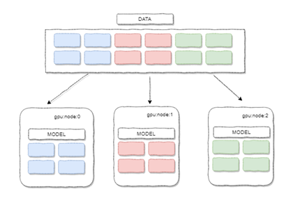
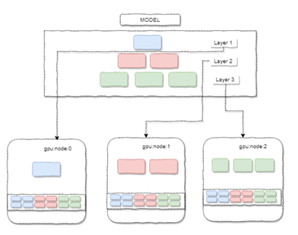
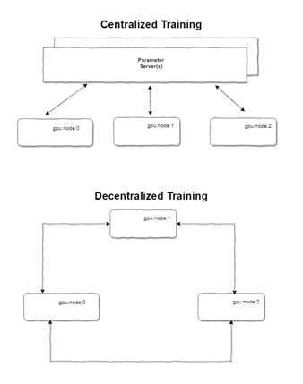
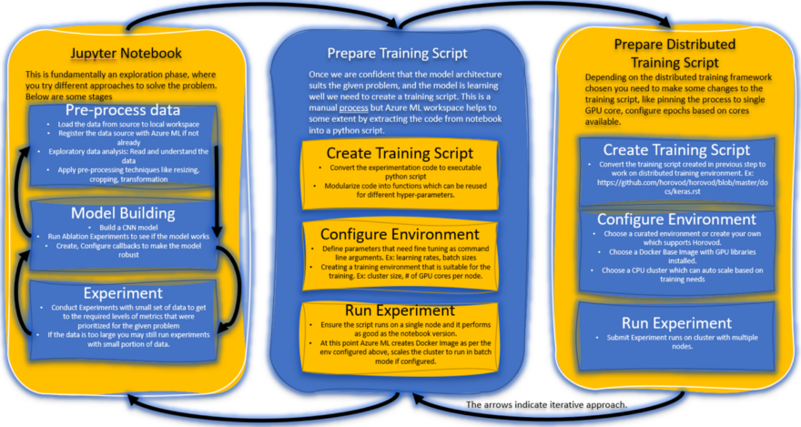
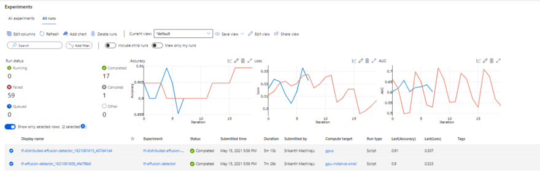
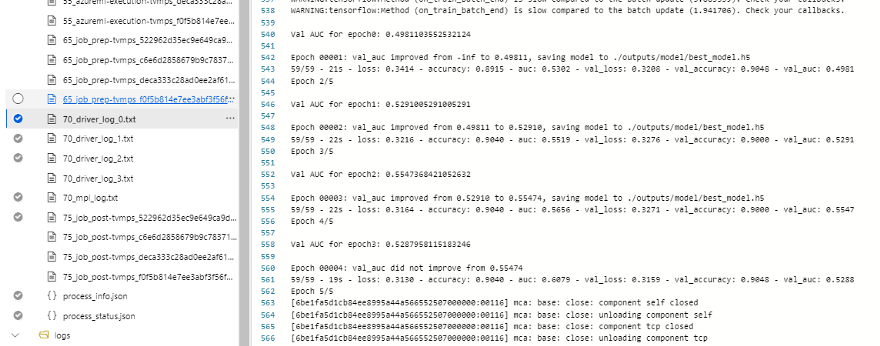
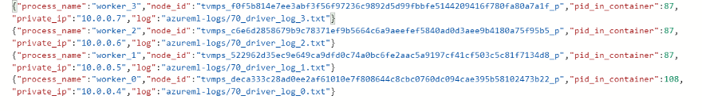
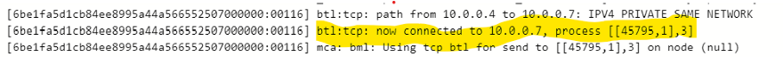

# Distributed training on Azure ML using Horovod.
Deep learning algorithms are well suited for large data sets and also training deep learning networks needs large computation power. With GPUs / TPUs easily available on pay per use basis or for free (like Google collab), it is possible today to train a large neural network on cloud-like say Resnet 152 (152 layers) on ImageNet database which has around 14 million images. But is a multi-core GPU-enabled machine just enough to train huge models. Technically yes, but it might take weeks to train the model once. So how do we reduce the training time? Any scalability issue can be solved using 2 approaches — scale-up or scale-out. We all know if we choose to scale up the capacity maxes out at some point, so the better alternative is scale-out. But, how do you do distributed training, if I have a model training using Jupyter notebook where do I start, can I perform distributed training for any deep learning model? This blog aims to answer these questions with a practical approach. 

In this blog we will learn how to apply scaled out or in other words, Distributed Machine Learning Techniques on the cloud. We will understand how we go from a Jupyter notebook phase which is the most agile way of building ML models to a production-ready training script that can run on a cluster of GPUs using Azure ML and Horovod.

If you’re new to distributed machine learning, here are some of the concepts/terminologies you should know before moving ahead.

## Data parallelism and Model Parallelism
In a data-parallel method, the entire model is deployed to multiple nodes of a cluster and the data is sharded (horizontally split). Each instance of the model works on a part of the data. 



In the Model parallel method, a layer (or group of layers) of the model is deployed on one node of a cluster, and the whole data is copied to the node, each node trains on the complete dataset.



The most common and easiest to implement is data parallelism, we will see a practical approach to it in the upcoming sections. One way of intuitively understanding how the data-parallel works is that the gradient is calculated for a small batch of data (say 30 images at once) in each GPU node and at the end of one round of forward-backward passes by the network, the updated weights are sent back to the initiating node. The weighted average of the weights from each node is applied to the model parameters. The updated model parameters are sent back to the nodes for the next round of iteration. 

This is almost similar to what happens when you train in batches in a non-distributed fashion. The key question here although is how are model parameters stored and updated in a data-parallel approach. This brings us to the next topic, centralized and de-centralized training.

## Centralized and de-centralized training.

Both in model-parallel or data-parallel training, the key is communication between the nodes, it’s important to define how the parameters are initialized, how the weights/biases are updated. 

There are two types of communication approaches. This applies to both the data-parallel and model parallel methods. In a centralized communication pattern, there exists a node or group of nodes responsible for synchronizing the model parameters, this node is called a parameter server. The advantage of the approach is it is easy to synchronize the model parameters, on the flip side the parameter server can itself become a bottleneck for a huge cluster. It is also a single point of failure. But of course, the bottleneck problem can be reduced to some extent by introducing multiple parallel servers and ensuring proper storage redundancy is applied.

In the de-centralized communication pattern, each node communicates with every other node to update the parameters. The advantage with this approach is that peer-peer updates are faster, sparse updates can be made by exchanging only what has changed and there is no single point of failure.



## Synchronous and asynchronous updates.

If you’re familiar with deep learning and know-how the weights are trained (if not you may read my articles [here](https://www.linkedin.com/pulse/understanding-backpropagation-neural-network-1-srikanth-machiraju/)), the updated weights are computed as soon as the gradients of loss function are available. In a distributed training using the data-parallel approach, the model parameters which are weights and biases can be updated in 2 ways.

1. Synchronously: let’s say we are dealing with 10k images and 10 nodes, each node is given a subset of 1k images, once they finish the first iterations the updated model parameters are sent to the parameter server. This approach greatly enhances the accuracy of the model, but the downside of this approach of course is that the server must wait for all the nodes to complete the iteration, if there is a dead slow server it may bring down the speed of the whole training.

2. Asynchronous: In this case instead of waiting for all the nodes to send the weight updates, they are sent as soon as they are available, this increases the cluster utilization and improves the training speed but of course leads to stale gradients problem. Most of the frameworks which implement asynchronous updates apply some strategies to reduce the impact in favor of higher cluster utilization.

Remember synchronous or asynchronous updates apply to both centralized and de-centralized training methods. Similarly synchronous and asynchronous updates can be applied to both weights and the updates to the weights, i.e., from the equation Weight(new) = Weight(old) — LR \* gradient loss, only the gradient losses with respect to the weights can be sent out after each iteration. To understand this better let us imagine we set up a cluster with synchronous updates and centralized training which means there is also a separate parameter service, each node sends the updates, and once all the updates are received on the parameter server, the new weights are computed, and then replicated across all the nodes for the next iteration.

Having discussed the pros and cons of how to store and update the model parameters, choosing the best one is always subjective to the problem, dataset, cluster size, and various factors. There is no one right solution for every problem.

## Frameworks for implementing Distributed Machine Learning
Map/Reduce, Apache Spark, Baidu All Reduce, Horovod, Caffe2, Microsoft Cognitive Tool Kit (CNTK), DistBelief, Tensorflow, DIANNE, MXNet, Petumm are the top frameworks available for distributed machine learning. A brief introduction of each one of these is available [here](https://analyticsindiamag.com/top-tools-distributed-machine-learning-tensorflow/).

Among these, the following are supported on Azure today in the workspace (PaaS) model — Apache Spark, Horovod (its available both on Databricks and Azure ML), TensorFlow distributed training, and of course CNTK.

## Horovod and Azure ML.

Distributed training can be done on Azure ML using frameworks like PyTorch, TensorFlow. Tensorflow’s distributed training support both centralized and decentralized training methods (more about it [here](https://www.tensorflow.org/guide/distributed_training)), if you already have a notebook using distributed TF you can easily import it into Azure ML. For this post, we will learn about Horovod.

Horovod is an open-source distributed deep learning framework for TF, Keras, PyTorch, and Apache MXNet which makes distributed training easy by reducing the number of changes to be done to the training script to run on multiple GPU nodes in parallel. You can learn more about Horovod [here](https://horovod.readthedocs.io/en/latest/summary_include.html).

You do not have to worry much amount setting up environments with Horovod, Azure ML provides curated training environments for setting up training using a variety of frameworks easily, one of them comes with TensorFlow and Horovod preloaded. These curated frameworks also allow customization if needed.

**Note**: You can also run native distributed TensorFlow on Azure ML using centralized or decentralized training methods explained above.
### Training process from Notebook phase to Distributed ML.

In this example, I was trying to perform an image classification with 2 classes using CNN. The images belong to chest X-rays, one class of images contains images with effusion detected and the other does not. For more information on the learning process, pre-processing, ablation experiments, etc. I recommend you to visit the code [here](https://github.com/sriksmachi/octopus). 

The below image explains the journey from a notebook phase to running training experiments on a cluster in a distributed fashion. 



Here is the code snippet where I run a single GPU training script on a Horovod enabled distributed training cluster with 4 nodes. 

```
import os

from azureml.core import ScriptRunConfig

import shutil

from azureml.core import Experiment

from azureml.core import Environment

from azureml.core.conda\_dependencies import CondaDependencies

from azureml.widgets import RunDetails

from azureml.core.runconfig import MpiConfiguration

\## The training script capable of running in distributed environment is extracted to effusion\_detector\_distributed.py

project\_folder = './effusion\_detector-distributed'

os.makedirs(project\_folder, exist\_ok=True)

shutil.copy('effusion\_detector\_distributed.py', project\_folder)

\## choosing an experiment name

experiment\_name = 'tf-distributed-effusion-detector'

experiment = Experiment(ws, name=experiment\_name)

\# loading the env dependencies from conda configuration

os.makedirs('./envs', exist\_ok=True)

tf\_env = Environment.from\_conda\_specification(name="imageclassification", file\_path="envs/distributed-tensorflow-with-horovod/conda\_dependencies.yml")

\# Specify a GPU base image

tf\_env.docker.enabled = True

tf\_env.docker.base\_image = 'mcr.microsoft.com/azureml/openmpi3.1.2-cuda10.1-cudnn7-ubuntu18.04'

\# using a cluster which can autoscale uptp 4 nodes.

cluster\_name = "gpus"

compute\_target = ComputeTarget(workspace=ws, name=cluster\_name)

\# running the script

args = ['--data-folder', dataset.as\_mount(), '--epochs', 20]

src = ScriptRunConfig(source\_directory=project\_folder,

script='effusion\_detector\_distributed.py',

arguments=args,

compute\_target=compute\_target,

environment=tf\_env, distributed\_job\_config=MpiConfiguration(node\_count=4))

run = experiment.submit(src)

print(run)

run.get\_details()
```

Here is an image that shows the outcome of the training, the first experiment is done using distributed training (4 nodes of 6 GPU cores each) and the second one is done using a single machine with 6GPU core. Processing Unit used for a single machine and the cluster [GPU — 1 x NVIDIA Tesla K80](https://www.nvidia.com/en-gb/data-center/tesla-k80) 

Experiment outcomes for distributed training and single machine training.

Few noticeable differences I found in distributed training.

1. The training time is reduced from 7.5 min to 5 min. 
1. 20 epochs were configured for the run, each node ran 5 epochs. (Note: This also means the early stopping could not be applied which had min tolerance set to 5 epochs, in the single machine training, the training finally stopped due to early stopping rule)

Image showing worker process 0 running 5 epochs.

3. Each worker process was given a private IP and the logs show that all of them were interconnected. 

Image showing each process given a private IP.
Image showing worker process 0 connected to worker process 3.

### Additional Reading
\- <https://stackoverflow.com/questions/53498952/tensorflow-horovod-nccl-and-mpi#:~:text=MPI%20is%20used%20for%20CPU,used%20for%20GPU%2DGPU%20communication>.

- <https://leimao.github.io/blog/Data-Parallelism-vs-Model-Paralelism/>
- <https://docs.microsoft.com/en-us/azure/machine-learning/how-to-train-tensorflow#distributed-training>

